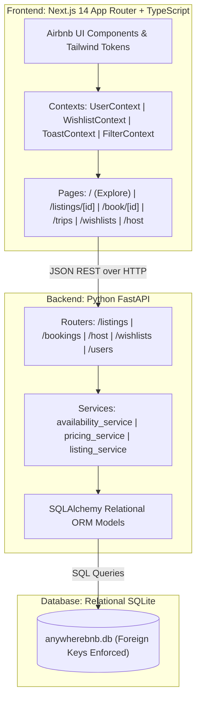
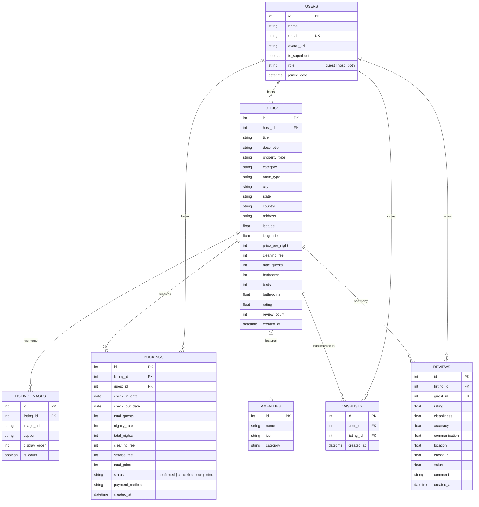

# Anywherebnb 🏡

> An end-to-end, production-grade Airbnb fullstack marketplace web application clone replicating Airbnb's signature design, responsive user experience, and core guest booking & host management workflows.

[](https://nextjs.org/)
[](https://www.typescriptlang.org/)
[](https://fastapi.tiangolo.com/)
[](https://python.org/)
[](https://www.sqlite.org/)
[](https://tailwindcss.com/)
[](https://pytest.org/)

---

## 🌐 Live Deployments

- **Frontend (Vercel)**: [https://anywherebnb.vercel.app](https://anywherebnb.vercel.app)
- **Backend API (Render)**: [https://anywherebnb-backend.onrender.com/api](https://anywherebnb-backend.onrender.com/api)
- **Interactive Swagger Docs**: [https://anywherebnb-backend.onrender.com/api/docs](https://anywherebnb-backend.onrender.com/api/docs)
- **GitHub Repository**: [https://github.com/Mahimachandna28/Anywherebnb](https://github.com/Mahimachandna28/Anywherebnb)

---

## 📸 Key Features & User Journeys

### 🌟 1. Guest Exploration & Search
- **Authentic Airbnb Home Page**: Signature category carousel (`Beachfront`, `Cabins`, `Amazing pools`, `Mansions`, `Lakefront`, `Tiny homes`, etc.) with responsive listing cards and smooth image carousels.
- **Interactive Search Pill & Drawer**: Expandable multi-tab search drawer filtering by **Where** (destination keyword search), **When** (check-in / check-out dates), and **Who** (guest counters with steppers for adults, children, and infants).
- **Multi-Attribute Filter Modal**: Filter by nightly price sliders ($min – $max), property type (`House`, `Apartment`, `Villa`, `Cabin`), room type, bedrooms, bathrooms, and dynamic amenity tags.

### 🏡 2. Property Showcase & Detail Page (`/listings/[id]`)
- **5-Photo Grid Collage**: Signature Airbnb header layout with primary cover and 4 secondary high-resolution architectural images.
- **Full-Screen Photo Modal**: High-performance photo gallery browser with captions and category labels.
- **Detailed Specifications**: Room arrangements, host superhost badges, dynamic amenities checklist, and 6-category guest review breakdown (Cleanliness, Accuracy, Communication, Location, Check-in, Value).

### 💳 3. Double-Booking Conflict Engine & Checkout (`/book/[id]`)
- **Real-Time Price Breakdown**: Dynamic price calculation (`nights × price_per_night + cleaning_fee + 14% service_fee`).
- **Calendar Date Blocking**: Automatically queries all active reservations for the property and disables reserved dates in the calendar picker.
- **Atomic Collision Validation**: Server-side mathematical interval validation preventing double-booking race conditions.
- **Checkout Review**: Trip breakdown, date verification, guest details, and mock payment method selection (`Credit Card`, `PayPal`, `Apple Pay`, `Google Pay`).

### 🧳 4. My Trips Reservation Management (`/trips`)
- **Reservation History**: Tabbed view displaying `Upcoming / Confirmed`, `Completed`, and `Cancelled` trips.
- **1-Click Cancellation & Date Release**: Real-time cancellation modal explaining refund terms; instantly releases blocked dates in SQLite and triggers optimistic UI updates.

### ❤️ 5. Dedicated Wishlists (`/wishlists`)
- **Saved Places Collection**: Centralized view of all saved vacation homes.
- **1-Click Removal & Undo Alert**: Removing a property triggers an optimistic deletion with an interactive 6-second **Undo** alert banner.
- **Live Search & Sharing**: Instant in-collection search filter and 1-click clipboard link sharing.

### 📊 6. Complete Host Management Suite (`/host`)
- **KPI Metrics Dashboard**: Real-time calculated analytics for:
  - **Total Revenue**: Total earnings across confirmed bookings.
  - **Active Listings Count**: Current portfolio inventory.
  - **Total Reservations**: Bookings count across all properties.
  - **Average Guest Rating**: Aggregate rating with star icon.
- **Listing Management Table**: Live search across title, city, and category, with direct view, edit, and delete triggers.
- **Safe Listing Deletion Modal**: Destructive confirmation modal detailing consequences, with immediate UI updates and backend cascade cleanup.
- **6-Step Listing Creator & Editor Wizard (`/host/create`, `/host/listings/[id]/edit`)**:
  - *Step 1*: Property Structure, Category, and Room Type.
  - *Step 2*: Street Address, City, State, and Country.
  - *Step 3*: Title and Description with character counters.
  - *Step 4*: Guest Capacity, Bedrooms, Beds, Bathrooms, Nightly Rate, and Cleaning Fee.
  - *Step 5*: Selectable Amenities from `/api/amenities`.
  - *Step 6*: Photo Gallery Manager with 1-click curated Unsplash presets and custom URL inputs.

### 🔔 7. Global Toast Notification System
- Ergonomic, accessible feedback toasts across the entire app for:
  - Wishlist saves and removals.
  - Listing creation, updates, and permanent deletions.
  - Reservation cancellations.
  - Link sharing copies.

---

## 🏗️ System Architecture



---

## 🗄️ Database Entity Relationship Diagram (ERD)



---

## 🔌 REST API Reference

| Method | Endpoint | Description | Request Body / Query Params | Response |
| :--- | :--- | :--- | :--- | :--- |
| `GET` | `/api/health` | Service health status | None | `{"status": "ok", ...}` |
| `GET` | `/api/categories` | Curated category carousel items | None | `CategoryItem[]` |
| `GET` | `/api/amenities` | Listing amenities list | None | `AmenityResponse[]` |
| `GET` | `/api/listings` | Search and filter listings | `destination, category, min_price, max_price, guests, property_type, skip, limit` | `{"items": ListingResponse[], "total": int}` |
| `GET` | `/api/listings/{id}` | Complete property details & booked dates | None | `ListingDetailResponse` |
| `POST` | `/api/listings` | Create a new listing (Host CRUD) | `ListingCreate` JSON | `ListingDetailResponse` (201) |
| `PUT` | `/api/listings/{id}` | Update listing details (Host CRUD) | `ListingUpdate` JSON | `ListingDetailResponse` (200) |
| `DELETE` | `/api/listings/{id}` | Delete listing & cascade photos (Host CRUD) | None | 204 No Content |
| `POST` | `/api/bookings/calculate-price` | Live price calc & availability check | `{"listing_id", "check_in_date", "check_out_date", "total_guests"}` | `PriceCalculationResponse` |
| `POST` | `/api/bookings` | Create confirmed reservation (Conflict validated) | `BookingCreate` JSON | `BookingResponse` (201) |
| `GET` | `/api/bookings/my-trips` | Retrieve guest reservation history | None | `BookingResponse[]` |
| `POST` | `/api/bookings/{id}/cancel` | Cancel reservation & release calendar | None | `BookingResponse` |
| `GET` | `/api/host/dashboard` | Host KPI metrics & recent reservations | None | `HostDashboardData` |
| `GET` | `/api/host/listings` | Host's published property inventory | None | `ListingResponse[]` |
| `GET` | `/api/wishlists` | Retrieve guest's favorited listings | None | `ListingResponse[]` |
| `GET` | `/api/wishlists/ids` | Array of favorited IDs for client hydration | None | `int[]` |
| `POST` | `/api/wishlists/toggle` | Toggle favorite state for a listing | `{"listing_id": int}` | `{"is_favorited": bool, ...}` |
| `GET` | `/api/users` | List available demo user personas | None | `User[]` |
| `GET` | `/api/users/me` | Current demo user profile | None | `User` |

---

## 🧪 Automated Testing Suite

The backend contains **33 comprehensive automated tests** written in `pytest`, testing domain logic, collision math, pricing formulas, and REST endpoints.

```bash
cd backend
pytest -v
```

### Test Suite Summary
```text
tests/test_bookings_api.py ......................... [PASSED]
tests/test_health.py ............................... [PASSED]
tests/test_host_api.py ............................. [PASSED]
tests/test_listings_api.py ......................... [PASSED]
tests/test_models.py ............................... [PASSED]
tests/test_seed.py ................................. [PASSED]
tests/test_services.py ............................. [PASSED]
tests/test_wishlists_api.py ........................ [PASSED]

======================== 33 passed in 2.55s ========================
```

---

## 💻 Local Setup & Development Guide

### Prerequisites
- **Node.js**: v18.0.0 or newer
- **Python**: 3.10, 3.11, or 3.12
- **Git**: Installed and configured

---

### 1. Clone the Repository
```bash
git clone https://github.com/Mahimachandna28/Anywherebnb.git
cd Anywherebnb
```

---

### 2. Backend Setup (FastAPI + SQLite)
```bash
cd backend

# Create virtual environment
python -m venv venv

# Activate virtual environment
# On Windows (PowerShell):
.\venv\Scripts\Activate.ps1
# On macOS/Linux:
source venv/bin/activate

# Install dependencies
pip install -r requirements.txt

# Seed SQLite database with 16 realistic properties & mock reviews
python seed.py

# Start development server
uvicorn app.main:app --reload --port 8000
```
Backend API will be live at `http://localhost:8000/api`.
Interactive OpenAPI documentation will be accessible at `http://localhost:8000/api/docs`.

---

### 3. Frontend Setup (Next.js 14 TypeScript)
In a new terminal window:
```bash
cd frontend

# Install npm dependencies
npm install

# (Optional) Verify .env.local configuration
# NEXT_PUBLIC_API_URL=http://localhost:8000/api

# Run development server
npm run dev
```
Open `http://localhost:3000` in your web browser.

---

### 4. Production Build Verification
To ensure type safety and production readiness:
```bash
cd frontend
npm run build
```

---

## 🎯 SDE Interview & Architectural Talking Points

### 1. Robust Double-Booking Collision Detection
- **The Challenge**: Avoiding race conditions and overlapping calendar bookings for high-demand vacation rentals.
- **The Solution**: An interval overlap algorithm executing at both the SQL and service layers:
  $$\text{Overlap} \iff \max(\text{start}_1, \text{start}_2) < \min(\text{end}_1, \text{end}_2)$$
  Same-day turnover is explicitly supported: a guest checking out on November 10th morning does not block a new guest checking in on November 10th afternoon.

### 2. Relational Integrity with SQLite
- SQLite by default does not enforce foreign keys unless explicitly configured.
- Anywherebnb enforces `PRAGMA foreign_keys = ON` on every database connection via SQLAlchemy event listeners (`connect` event hook in `app/core/database.py`), ensuring that deleting a listing correctly cascades to child records (`listing_images`, amenity joins) without orphaned rows.

### 3. Client-Side Optimistic Updates with Rollback
- Favoriting a property (`WishlistContext`) and deleting a listing (`HostDashboard`) update the client state **optimistically** with zero perceptual latency.
- If the network request fails, the state automatically reverts to its previous snapshot and alerts the user with an actionable toast.

### 4. Dynamic Polymorphic Wizard Architecture
- Rather than maintaining two separate form components for listing creation and listing editing, [`ListingWizardForm.tsx`](frontend/src/components/host/ListingWizardForm.tsx) unifies the 6-step state machine.
- Passing `initialData` dynamically adapts the form into edit mode (`PUT /api/listings/{id}`), pre-populating all state variables, while omitting it enables create mode (`POST /api/listings`), drastically reducing code duplication.

### 5. Verified Server-Side Financial Calculations
- Financial amounts (`nights × rate + cleaning_fee + 14% service_fee`) are never accepted directly from client inputs. The frontend requests `/api/bookings/calculate-price` for live UI previews, but the final booking creation endpoint always re-derives the authoritative total price directly from the database record, preventing client-side price tampering.

---

## 📜 License
This project was built as a fullstack software engineering demonstration. Released under the MIT License.